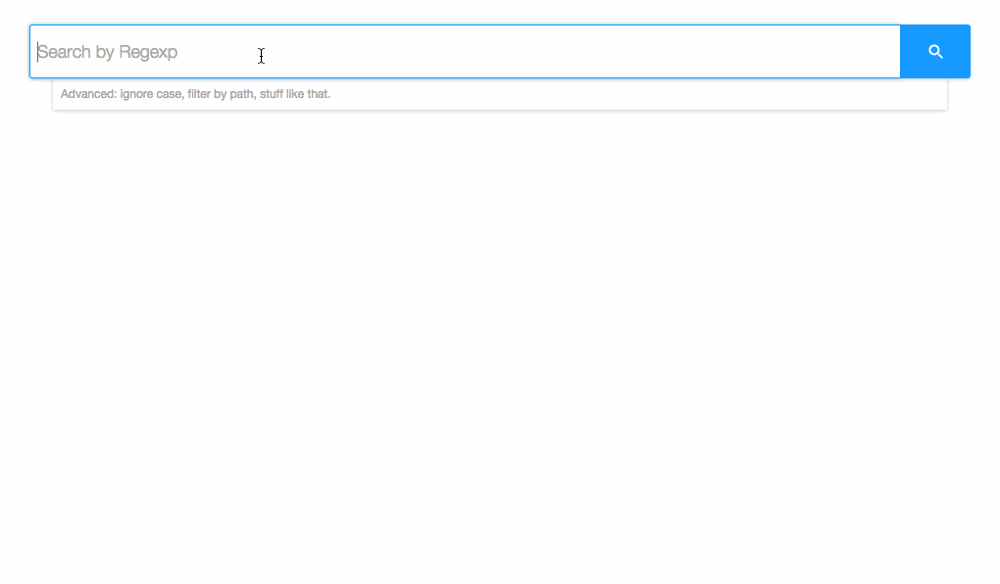

# Hound

Hound is an extremely fast source code search engine. The core is based on this article (and code) from Russ Cox:
[Regular Expression Matching with a Trigram Index](http://swtch.com/~rsc/regexp/regexp4.html). Hound itself is a static
[React](http://facebook.github.io/react/) frontend that talks to a [Go](http://golang.org/) backend. The backend keeps an up-to-date index for each repository and answers searches through a minimal API. Here it is in action:



## Quick Start Guide

#### Preferred Method

This is the preferred approach, since the binaries are generally easier to work with, and make will build both the server and the CLI binaries at the same time. 

1. Clone the repo: `git clone https://github.com/etsy/Hound.git`
2. Edit [config-example.json](config-example.json) to add the repos you want: `cd Hound && vim config-example.json`
3. Rename the (now edited) config file: `mv config-example.json config.json`
4. `make`
5. `./bin/houndd`
6. See Hound in action in your browser at [http://localhost:6080/](http://localhost:6080/)

#### Using only Go tools.

Alternatively, you can avoid the use of make and just use go tools.

1. Clone the repo: `git clone https://github.com/etsy/Hound.git`
2. Edit [config-example.json](config-example.json) to add the repos you want: `cd Hound && vim config-example.json`
3. Rename the (now edited) config file: `mv config-example.json config.json`
4. Set your GOPATH: ``export GOPATH=`pwd` ``
5. Run the server: `go run src/hound/cmds/houndd/main.go`
6. See Hound in action in your browser at [http://localhost:6080/](http://localhost:6080/)

#### Why can't I use `go get`?

That's coming, we just need to make it easier to bundle the javascript/css assets so it all works seamlessly.

## Why Another Code Search Tool?

We've used many similar tools in the past, and most of them are either too slow, too hard to configure, or require too much software to be installed.
Which brings us to...

## Requirements

### Hard Requirements
* Go 1.3+

### Optional, Recommended Software
* Make (for building the binaries, not strictly required)
* nodejs (for the command line react-tools)

Yup, that's it. You can proxy requests to the Go service through Apache/nginx/etc., but that's not required.

## Docker
* docker 1.4+

You should follow the quickstart guide up to step (3) and then run:

    $ docker build -t houndd .
    $ docker run -it --rm -p 0.0.0.0:6080:6080 --name houndd houndd

You should be able to navigate to [http://localhost:6080/](http://localhost:6080/) as usual.

## Support

Currently Hound is only tested on MacOS and CentOS, but it should work on any *nix system. There is no plan to support Windows, and we've heard that it fails to compile on Windows, but we would be happy to accept a PR that fixes this!

Right now Hound supports git and mercurial, and SVN support is being added. By default Hound expects git repositories, so to use mercurial you have to specify `"vcs" : "hg"` in the config as shown in [config-example.json](config-example.json).

## Private Repositories

There are a couple of ways to get Hound to index private repositories:

* Use the `file://` protocol. This allows you to index any local folder, so you can clone the repository locally 
and then reference the files directly. The downside here is that the polling to keep the repo up to date will
not work.
* Use SSH style URLs in the config: `"url" : "git@github.com:foo/bar.git"`. As long as you have your 
[SSH keys](https://help.github.com/articles/generating-ssh-keys/) set up on the box where Hound is running this will work. There is currently an [issue](https://github.com/etsy/Hound/issues/19) with URLs in this case that we hope to fix soon.

## Keeping Repos Updated

By default Hound polls the URL in the config for updates every 30 seconds. You can override this value by setting the `ms-between-poll` key on a per repo basis in the config. You can see how this works in the [example config](config-example.json).

## Editor Integration

Currently the following editors have plugins that support Hound:

* [Sublime Text](https://github.com/bgreenlee/SublimeHound)
* [Vim](https://github.com/urthbound/hound.vim)
* [Emacs](https://github.com/ryoung786/hound.el)

## Hacking on Hound

### Building

```
make
```

This will build `./bin/houndd` which is the server binary and `./bin/hound` which is the command line client.

### Running in development

```
./bin/houndd
```

This will start up the combined server and indexer. The first time you start the server, it will take a bit of time to initialize your `data` directory with the repository data.
You can access the web frontend at http://localhost:6080/

### Running in production

```
./bin/houndd --prod --addr=address:port
```

The will start up the combined server/indexer and build all static assets in production mode. The default addr is ":6080", and thus the `--addr` flag can be used to have the server listen on a different port.

## Get in Touch

IRC: #codeascraft on freenode

Created at [Etsy](https://www.etsy.com) by:

* [Kelly Norton](https://github.com/kellegous)
* [Jonathan Klein](https://github.com/jklein)
